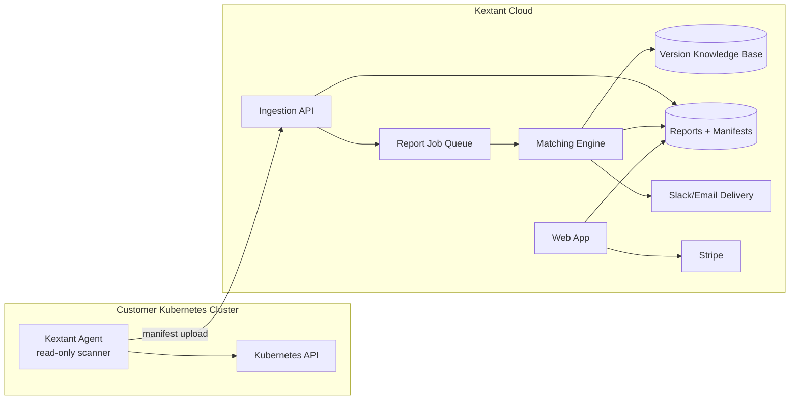

# Kextant Technical Plan

## 1. Target architecture

Design principle: the agent is deterministic and read-only; the cloud is where intelligence, enrichment, billing, and history live.

## 2. Repo plan

| Repo | Visibility | Contents | Notes |
| --- | --- | --- | --- |
| `kextant-agent` | Public eventually | Go in-cluster scanner, local health reports, inventory manifest, Helm chart | This current repo should stay focused on agent functionality |
| `kextant-cloud` | Private | API, workers, matching engine, report generator, auth, tenant model, billing integration | Create next; contains paid product backend |
| `kextant-web` | Private or public marketing/private app | Landing site, docs site, onboarding UI, report history UI, billing portal | Can be Next.js/React |
| `kextant-kb` | Private initially or subdirectory in cloud | KB schemas, seed data, enrichment jobs, admin tooling | Start inside `kextant-cloud` if speed matters; split when it needs independent deployment |
| `kextant-infra` | Private | Terraform/CDK/Pulumi for cloud resources | Could also be `/infra` under `kextant-cloud` until infrastructure grows |

Avoid mixing SaaS backend code into the agent repo. The agent must remain easy to audit and trust.

## 3. Current repo evolution: `kextant-agent`

### Existing baseline

The current agent already includes:

- Scheduled and manual scans.
- Health checks for resources, probes, replicas, image configuration, security context, deprecated APIs, and namespaces.
- Plain text/log, Slack, and email report delivery.
- Read-only Kubernetes client usage.
- ConfigMap/Secret based configuration.
- Exemption support.

### Required additions

1. **Inventory package**
   - New internal package, e.g. `internal/inventory`.
   - Collects components, nodes, Helm releases, and CRDs.
   - Produces JSON manifest separate from health report.

2. **Manifest types**
   - New shared types, e.g. `pkg/types/manifest.go`.
   - Versioned schema: `schema_version: "1.0.0"`.

3. **Cloud upload client**
   - New package, e.g. `internal/cloud`.
   - POST manifest to `/v1/manifests`.
   - API key initially; mTLS can be added before enterprise launch.
   - Retries with backoff and clear logs.

4. **CLI commands**
   - `inventory` or `scan --manifest` to print JSON locally.
   - `scan --upload` to upload inventory and optionally health report.
   - Existing `scan --send` behavior should continue.

5. **Helm chart**
   - Create a first-class Helm install path.
   - Values for cloud upload, report delivery, namespace filters, redaction, Helm secret access.

6. **RBAC updates**
   - Add `nodes` read.
   - Add `customresourcedefinitions.apiextensions.k8s.io` read.
   - Add `secrets` read only when Helm release scanning is enabled; document why.

## 4. Cloud backend approach

### Recommended MVP stack

Choose speed and operability over perfect architecture:

- API/backend: Go or TypeScript service.
- Database: managed Postgres.
- Object storage: S3-compatible bucket for raw manifests and generated report artifacts.
- Queue/jobs: managed queue or database-backed job runner for MVP.
- Email: Postmark, SES, or Resend.
- Slack: incoming webhooks initially.
- Billing: Stripe Checkout + Billing Portal.
- Hosting: Render/Fly/Railway for speed, or AWS ECS/Lambda if keeping everything AWS-native is preferred.

The original serverless AWS design is still valid, but a single managed service plus Postgres may be faster for a nights/weekends build. The architecture should keep interfaces clean so it can move to Lambda/DynamoDB later if needed.

### Core services

| Service | Responsibility |
| --- | --- |
| Auth/account service | Users, organizations, sessions, API keys |
| Cluster service | Cluster registration, credentials, install command generation |
| Manifest ingestion | Validate and store manifests, enqueue reports |
| Matching engine | Map inventory to KB components and generate findings |
| Report service | Store reports, render Slack/email/JSON/HTML |
| Delivery service | Send scheduled or triggered reports |
| Billing service | Stripe subscriptions, tier enforcement |
| KB admin/enrichment | Maintain component catalog and confidence scores |

## 5. Data model sketch

### Tenant tables

- `organizations`
- `users`
- `memberships`
- `clusters`
- `cluster_credentials`
- `manifests`
- `reports`
- `report_findings`
- `delivery_targets`
- `subscriptions`

### Knowledge-base tables

- `kb_components`
- `kb_component_aliases`
- `kb_images`
- `kb_helm_charts`
- `kb_crds`
- `kb_versions`
- `kb_eol_cycles`
- `kb_cves`
- `kb_upgrade_paths`
- `kb_replacements`
- `kb_sources`

Every KB row that can be uncertain should include:

- `confidence_score`
- `source_url`
- `source_type`
- `last_verified_at`
- `verified_by` (`manual`, `github`, `artifacthub`, `nvd`, `llm_assisted`, etc.)

## 6. API contracts for MVP

| Method | Endpoint | Purpose |
| --- | --- | --- |
| `POST` | `/v1/manifests` | Agent submits inventory manifest |
| `GET` | `/v1/reports/latest?cluster_id=...` | Get latest report |
| `GET` | `/v1/reports/{report_id}` | Get report detail |
| `GET` | `/v1/clusters/{cluster_id}/install` | Get install command/config |
| `POST` | `/v1/delivery-targets` | Configure email/Slack |
| `GET` | `/v1/kb/status` | Show KB freshness and coverage |

The public API can be small at launch. Internal APIs can remain private.

## 7. Matching engine plan

### Waterfall matching

1. Helm release chart name/appVersion.
2. Known image repository patterns.
3. CRD group/name to operator mapping.
4. OCI labels if available later.
5. Digest matching if registry inspection is added later.
6. Unknown fallback.

Never invent matches. Unknown is acceptable and improves trust.

### Severity inputs

- Project status: active, maintenance, deprecated, abandoned.
- EOL status for current version.
- Version gap: patch/minor/major and age.
- Known replacement project.
- CVE count/severity when available.
- Kubernetes version compatibility constraints.
- Match confidence.

## 8. Knowledge-base build strategy

### Phase 1: curated seed

Manually seed the first 100-200 components using the real production audit as a guide plus common CNCF/EKS ecosystem components:

- Ingress/controllers: ingress-nginx, AWS Load Balancer Controller, cert-manager.
- GitOps: Argo CD, Flux.
- Observability: Prometheus, Grafana, Loki, Mimir, Tempo, Jaeger, Alloy/Grafana Agent, kube-state-metrics.
- Security/secrets: External Secrets Operator, Sealed Secrets, Vault, Trivy Operator, Kubescape.
- Autoscaling: Cluster Autoscaler, Karpenter, metrics-server, VPA.
- Service mesh: Istio, Linkerd, Consul.
- Datastores/operators: ClickHouse, Postgres operators, Redis operators, Elasticsearch/OpenSearch operators.
- Legacy/replacement cases: Kiam -> IRSA/EKS Pod Identity, Grafana Agent -> Alloy.

### Phase 2: automated refresh

Add jobs for:

- GitHub Releases API.
- Artifact Hub chart metadata.
- endoflife.date API.
- NVD and GitHub Advisory Database.
- Container registry tag discovery.

### Phase 3: LLM-assisted enrichment

Use LLMs only offline/server-side for:

- Changelog summarization.
- Breaking change extraction.
- Migration guide condensation.
- Project status classification.

All LLM-derived fields require confidence scores and source links.

## 9. Security and privacy plan

### Agent

- Read-only RBAC only.
- No secret values collected.
- Helm secret metadata parsing must not upload release secret payloads beyond chart/app metadata required for version matching.
- Optional redaction for namespaces, workload names, labels, and annotations.
- Clear `--dry-run` / local export mode.

### Cloud

- TLS for all traffic; mTLS before larger enterprise customers.
- API keys scoped to one cluster.
- Encrypt manifests and reports at rest.
- Separate tenant IDs on every row.
- Audit logs for manifest submission, report reads, config changes, and billing events.
- Short free retention by default.

## 10. Implementation order

1. Add manifest types and inventory collector to agent.
2. Generate local JSON manifest from a real cluster.
3. Build a local/offline report generator against a static KB file.
4. Create Kextant Cloud ingestion API and store manifests.
5. Move matching/report generation into cloud worker.
6. Add email/Slack delivery from cloud.
7. Add web onboarding and Stripe.
8. Add automated KB refresh jobs.
9. Add paid-tier gates.

## 11. Technical risks

| Risk | Mitigation |
| --- | --- |
| Image-to-project matching is wrong | Confidence scores, unknown fallback, manual overrides |
| KB maintenance becomes too manual | Start curated, automate top components, use source links and admin workflow |
| Customers distrust manifest upload | OSS agent, local export, redaction, exact manifest docs |
| Backend scope expands too fast | Keep dashboard minimal; report is the product |
| Enterprise security asks slow launch | Launch to small teams first; defer SSO/SOC2/on-prem |
